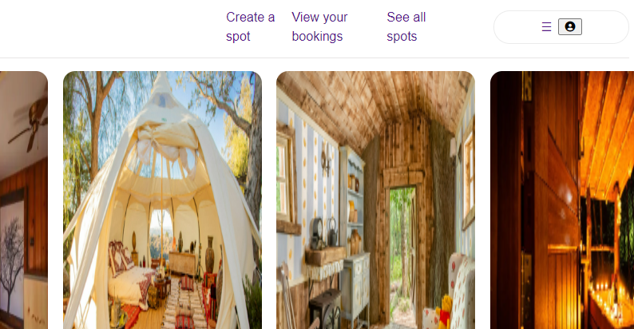
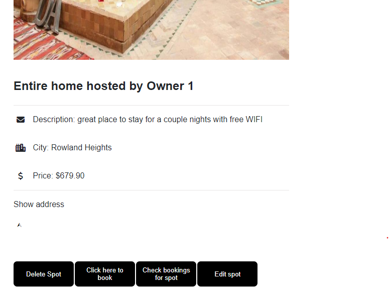

# `AirBnb Project - tiff's airbnb`

## Purpose of Project

My project aims to clone the website Airbnb.com -- a popular living-space rental company. It is a full stack project with the core backend functionalities of the original website and near pixel-perfect replica of its UI. All tools/technologies are listed below:

### Backend: Express, Sequelize
### Frontend: React, Redux, HTML & CSS

### INSTRUCTIONS for running locally

1. run ```git clone repo_link_url_address``` to have my project downloaded to your local repo. cd into repo and run 'code .' to have it open on vscode
2. run ```cd .. ``` and then ```npm i``` to install packages needed to run code on heroku properly
3. run ```cd frontend``` and then ```npm i``` inside frontend folder to download necessary packages from package.json
4. run ```cd backend``` and then ```npm i``` inside backend folder (repeating step 2)
5. while in the backend, run ```npm start``` to start server at port 8000
6. open another terminal from vscode and run ```npm start``` to start front end server at port 3000

### INSTRUCTIONS for navigating the page

1. When you are on home/splash/landing page, you will see all spots in a grid form. There are 3 links at the top ("create a spot", "view your bookings", "see all spots") where you can navigate to the CREATE "/spot/new" endpoint, GET "/users/bookings" endpoint, and GET "/spots" endpoint (which is the current homepage)



2. Click on any card to fetch the GET /spots/:spotId endpoint. You will find all the specific spot info here. 4 buttons at the bottom will inform you on exactly which feature and which CRUD is applicable. (The 'reserve' div is not a clickable button, but rather for just as display to demonstrate how it will look in the future). We will not test edit spot yet as it's not a requirement.



#### For Forms (features: spots and bookings)
1) CREATE spot form can be accessed from the top nav bar, with the clickable link "Create a spot". 
2) EDIT spot form can be accessed at the bottom of the "/spots/:spotId" page .
2) CREATE booking form (from /spots/:spotId/bookings/new) can be accessed near the same location as #2,  at the bottom of the "/spots/:spotId" page.
