# `Tiffs-airbnb` - Airbnb clone

## Purpose of Project

My project aims to clone the website Airbnb.com -- a popular living-space rental company. It is a full stack project with the core backend functionalities of the original website and near pixel-perfect replica of its UI. All tools/technologies are listed below:

### Backend: Express, Sequelize
### Frontend: React, Redux, HTML & CSS

### INSTRUCTIONS for running locally

1. run ```git clone https://github.com/tyang2015/Backup-for-tiff-s-airbnb.git``` to have my project downloaded to your local repo. cd into repo and run 'code .' to have it open on vscode
2. run ```cd .. ``` and then ```npm i``` to install packages needed to run code on heroku properly
3. run ```cd frontend``` and then ```npm i``` inside frontend folder to download necessary packages from package.json
4. run ```cd backend``` and then ```npm i``` inside backend folder (repeating step 2)
5. while in the backend, run ```npm start``` to start server at port 8000
6. open another terminal from vscode and run ```npm start``` to start front end server at port 3000

### INSTRUCTIONS for navigating the page
## Get All Spots
When you are on home/splash/landing page, you will see all spots in a grid form. It will show you some brief details of the spot itself, such as avg rating and price per night. To access more of the features of my website, login through demo user by clicking the top right profile icon -> then click "Demo User".

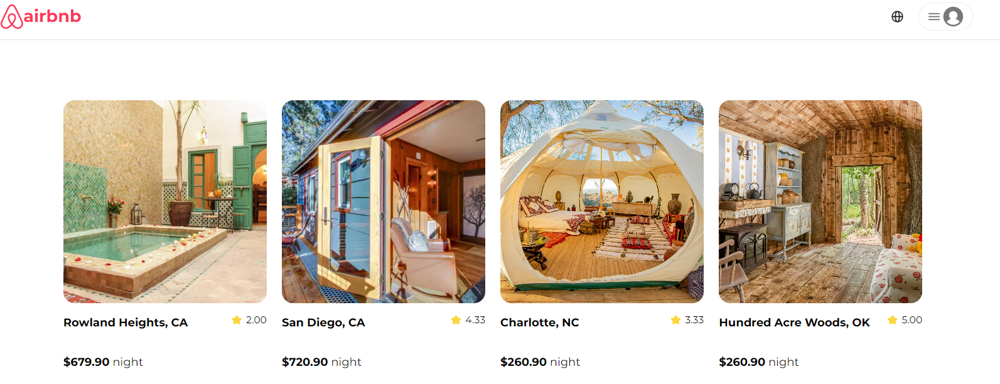

### View Spot
You can get more info on a spot by clicking a spot to view the spot page. This is also where you can view the reviews as well as bookings calendar. Many of the website's features are located on this page, including a map of the location, so feel free to explore it in more detail.

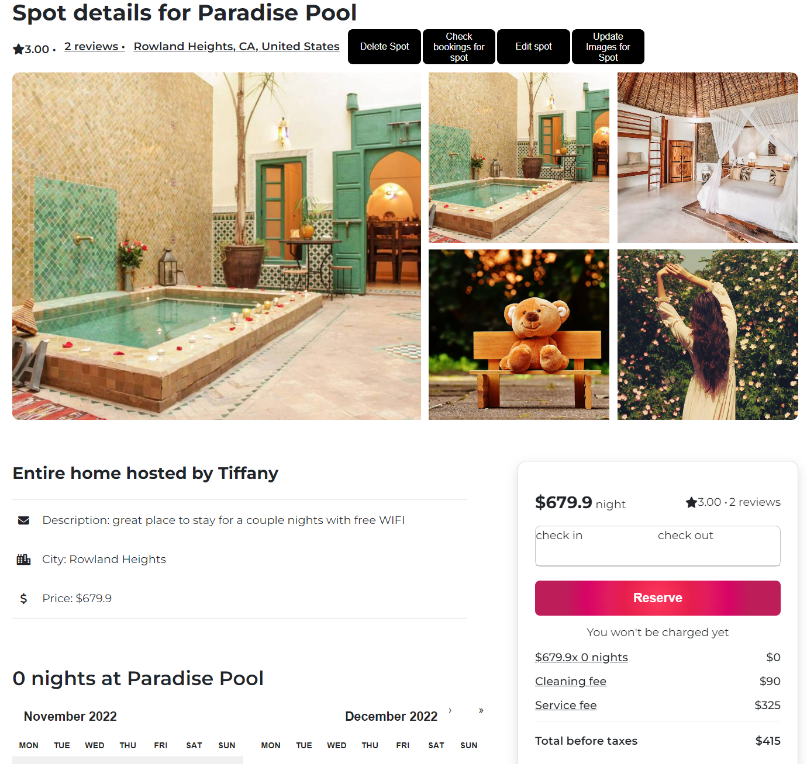

### Create Spot
Once logged in, click the profile button on the top right, and click "Create a Spot". This will show you a pop-up modal where you can fill in information for a new spot as its owner/host (eg., latitude, price, address, etc.).

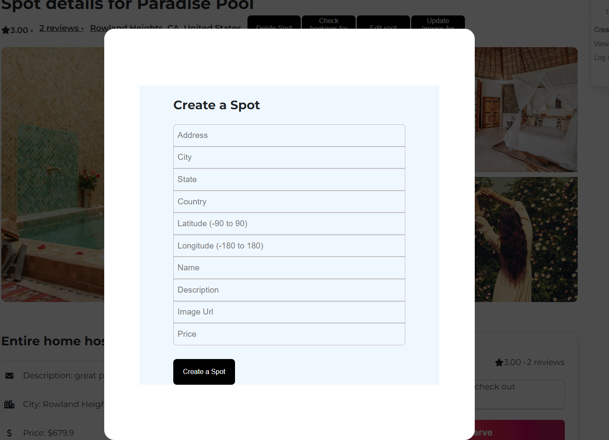

### Edit Spot
You can edit a spot by clicking "Edit spot" on the top header row on the spot page. Note that you must have proper authorization as the owner of the spot to make edits. Fill out the info as you would for create a spot.

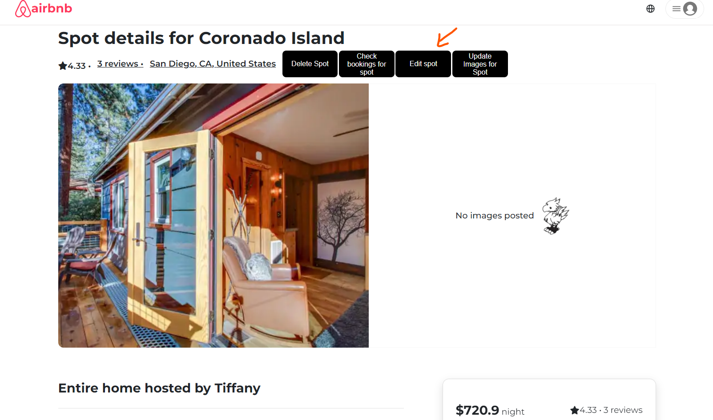

### Upload Image
In the same section as where you'd edit a spot, click "Update Images for Spot" to upload an image for the spot. This also requires proper authorization. This will be displayed in the right 4 picture grid (max 4 photos, not including cover photo which is required for creating a spot) on the spot page, next to the cover photo. The upload image page should have a plus icon container where you directly upload an image locally.

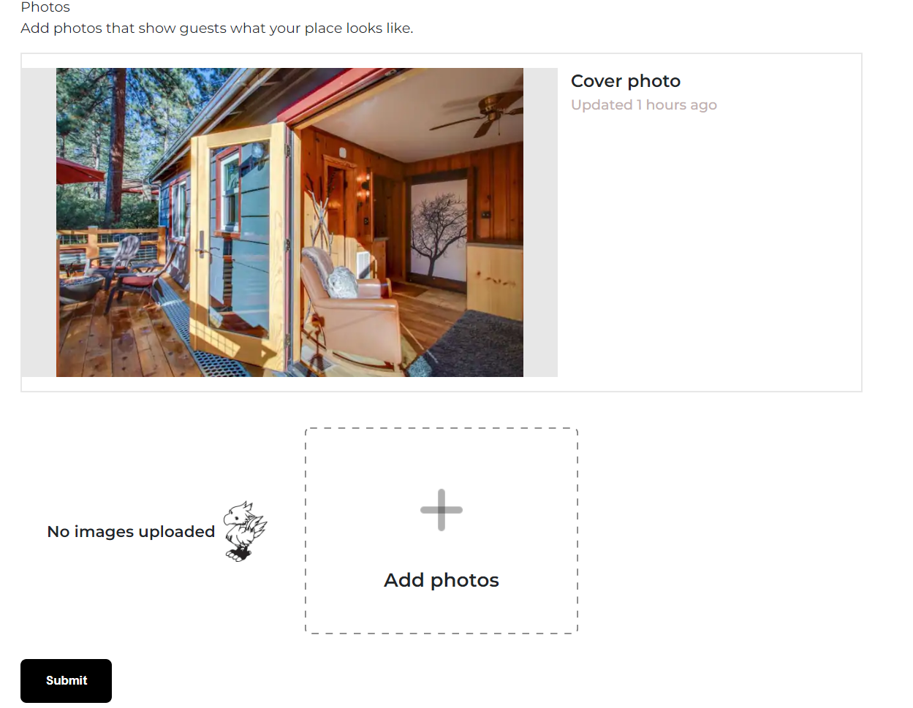


### Edit Image
While on the upload image page, click the pencil-icon on an already uploaded image to change the photo. The page should look like this: 

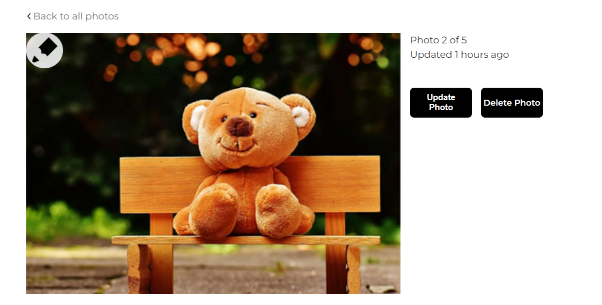

### Create Booking
On the spot-page, in the middle section of the page you will find an interactive calendar, where you can select dates with your mouse and it will display the number of nights, price/night, total cost, etc. Once booked, it will take you to your bookings page.

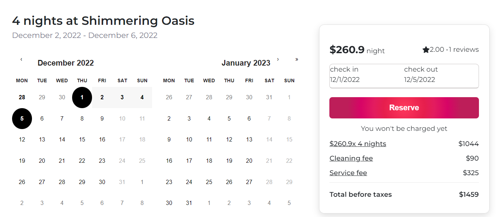

### View Bookings / Update Booking / Delete Booking
You can click the profile icon on the top, and click "View your bookings" to navigate to this page. Here you can update and delete a booking by clicking the trash or pencil icons.
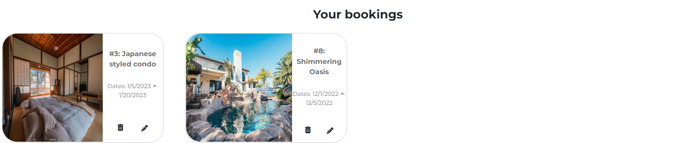

The update booking page looks like this: 

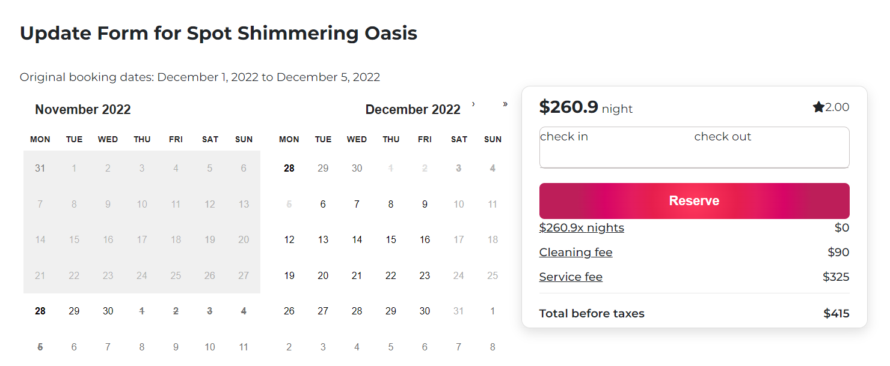

### View Spot Bookings
Back on the spot page, click "Check Bookings for spot" to see the spot bookings

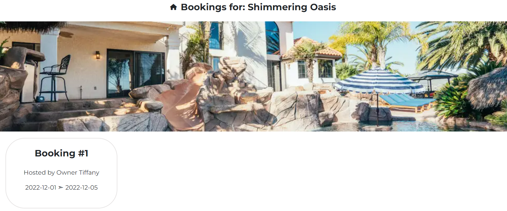


### Create a Review / Update a Review / Delete a Review
On the spot page, scroll past the calendar section to see the reviews section. Here you can create a review (Note: you cannot review a spot you own).

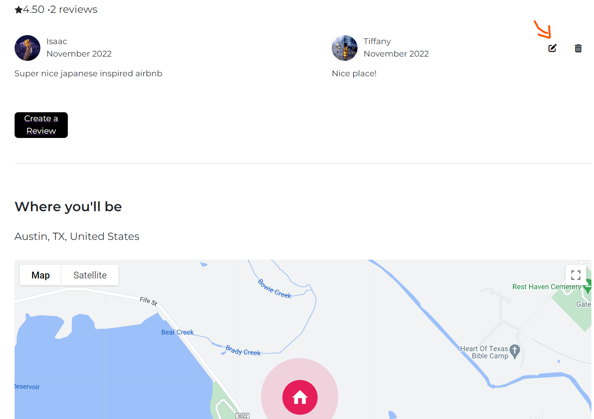

The review page looks like this, where you select the number of stars and leave a description of the spot: 

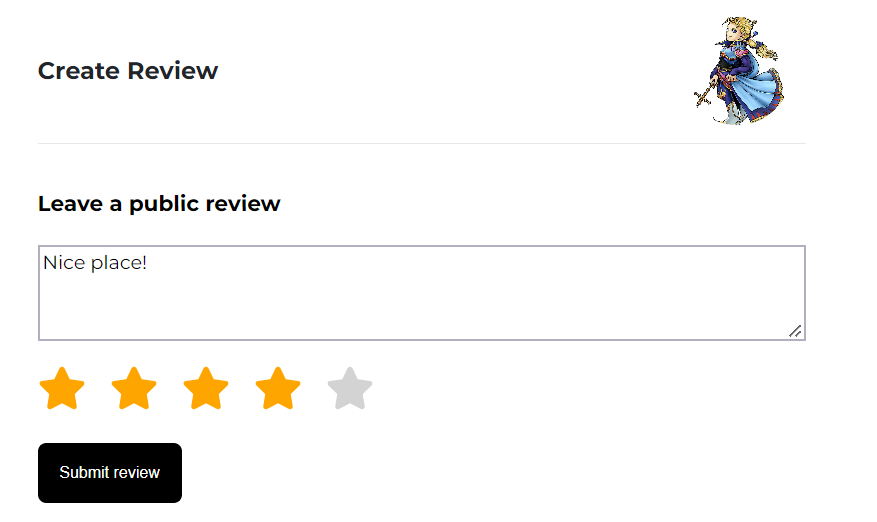

You can edit/delete your review by clicking the pencil or trash icons.

## Thanks for visiting Tiff's Airbnb!
Hope you had a nice tour of the website :) Shoot me an email for any inquiries or feedback at tiffanyang2015@gmail.com

